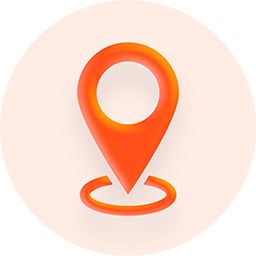
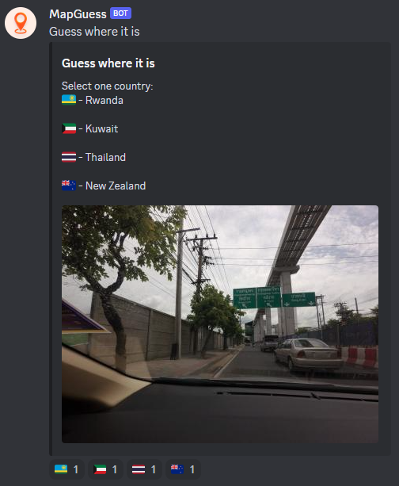

<h1>MapGuess Discord Bot</h1>
<h3>Written in Go</h3>

# Overview
Discord game where players have to guess the country from a photo.\
The app uses [DiscordGo](https://github.com/bwmarrin/discordgo) for Discord bindings & [OpenStreetCam API](http://doc.kartaview.org) to get photos.

# Instructions
1) Rename ``.env.example`` file to ``.env`` and replace ``YOURTOKEN`` with [your bot's token](https://discord.com/developers/applications/)
2) Run the bot by typing ``go run .`` in the terminal
3) Type ``/start`` in the Discord channel with your bot 
